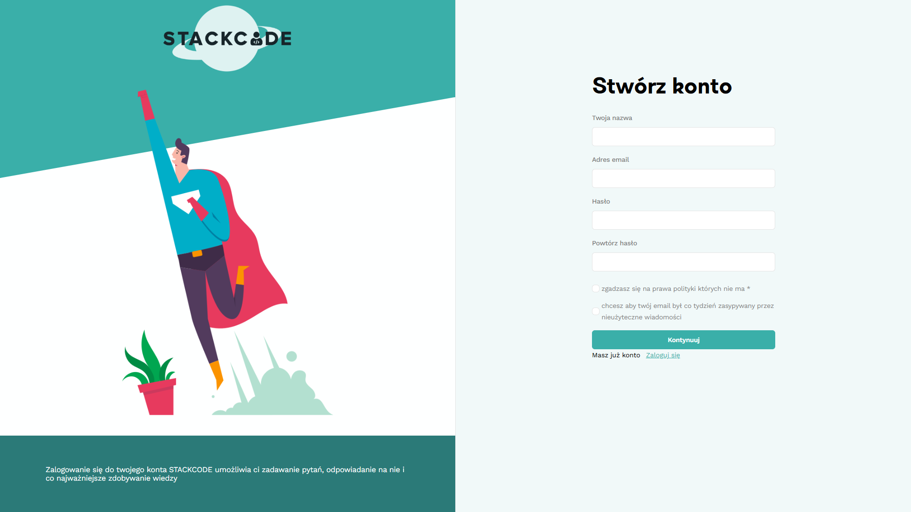

  

  <h3>Stackcode</h3>
  
Forum dla programistów gdzie można zadawać i odpowiadać na pytania. Wzorowane na stackoverflow.

## Kilka zdjęć strony

Więcej zdjęć strony <a href="./client/public/stackcode">tutaj</a>.

## Kilka ważniejszych bibliotek npm użytych w projekcie

* 
* 
* 
* 
